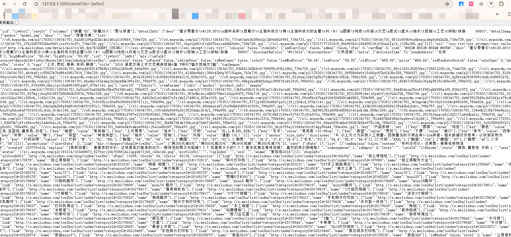
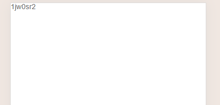
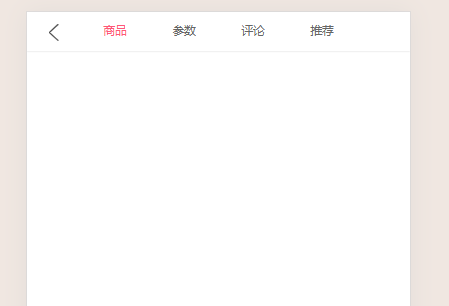
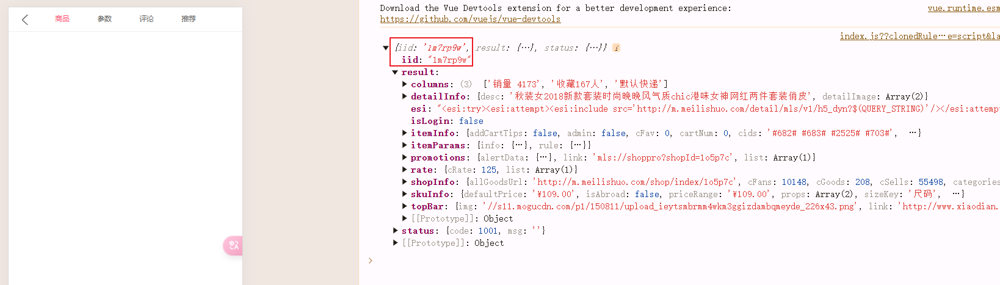
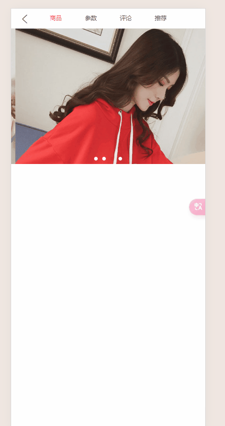
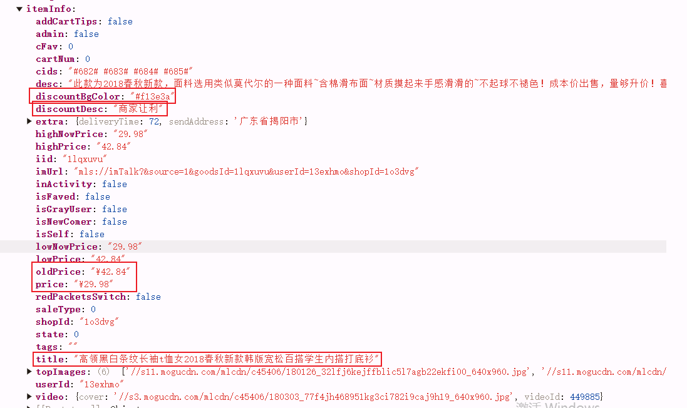
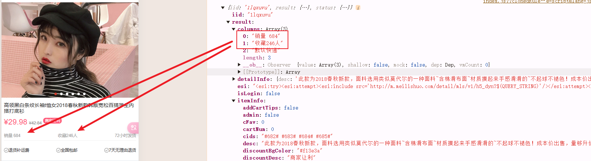
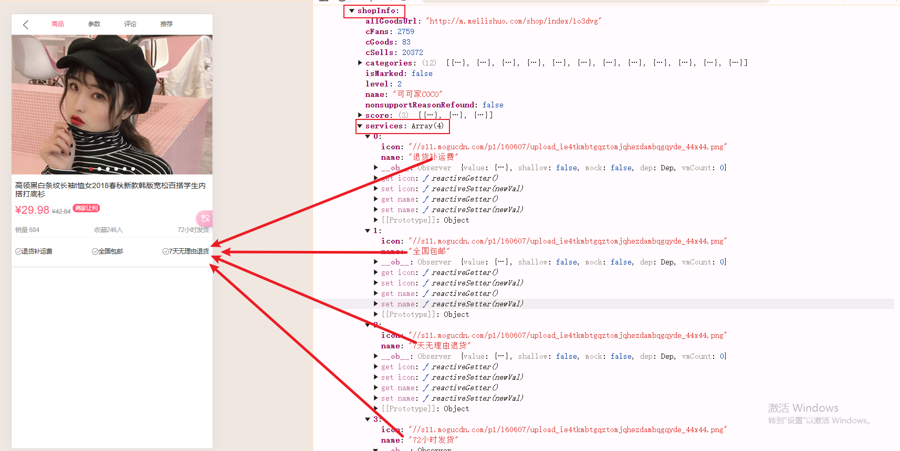
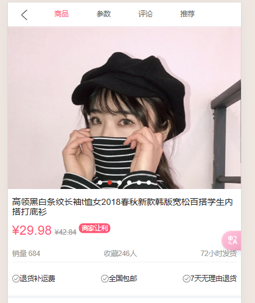
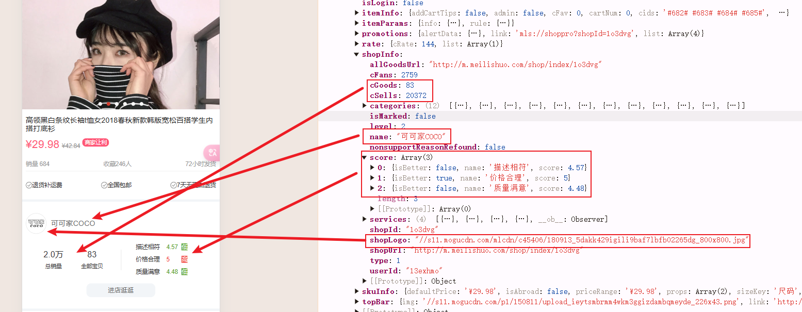

# 项目_07

## 首页-详情页跳转

在GoodListItem.vue中添加点击事件

```js
<template>
  <div class="goods-item" @click="itemClick">
  </div>
</template>

methods: {
  itemClick() {
    this.$router.push('/detail/' + this.goodsItem.iid)
  }
}
```

详情页添加路由，在router/index.js中

```js
const Detail = () => import('../views/detail/Detail')

const routes = [
  {
    path: '/detail/:iid',
    component: Detail
  }
]
```

在views中新建一个文件夹detail，在下面创建一个Detail.vue的组件

请求127.0.0.1:3000/detail?iid=xxxxx返回数据



### 取出iid

Detail.vue

```js
<template>
  <div id="detail">
    {{iid}}
  </div>
</template>

data() {
  return {
    iid: null,
  }
},

created() {
  // 1.保存传入的iid
  this.iid = this.$route.params.iid
},
```

显示iid



## 导航栏

创建一个childComps，在其中创建DetailNavBar.vue子组件

DetailNavBar.vue

```js
<template>
  <div>
    <nav-bar>
      <div slot="left" class="back" @click="backClick">
        
      </div>
      <div slot="center" class="title">
        <div v-for="(item, index) in titles"
             class="title-item"
             :class="{active: index === currentIndex}"
             @click="titleClick(index)">
          {{item}}
        </div>
      </div>
    </nav-bar>
  </div>
</template>

<script>
  import NavBar from 'components/common/navbar/NavBar'

  export default {
    name: "DetailNavBar",
    components: {
      NavBar
    },
    data() {
      return {
        titles: ['商品', '参数', '评论', '推荐'],
        currentIndex: 0
      }
    },
    methods: {
      titleClick(index) {
        this.currentIndex = index
      },
      backClick() {
        this.$router.back()
      }
    }
  }
</script>

<style scoped>
  .title {
    display: flex;
    font-size: 13px;
  }

  .title-item {
    flex: 1;
  }

  .active {
    color: var(--color-high-text)
  }

  .back img {
    margin-top: 12px;
  }
</style>
```

在Detail.vue中引用

```js
<template>
  <div id="detail">
    <detail-nav-bar class="detail-nav"/>
  </div>
</template>

import DetailNavBar from './childComps/DetailNavBar'
components: {
  DetailNavBar,
},
```

效果展示如图所示：



## 请求数据

在network中创建detail.js，将所有的详情页中网络请求封装起来

```js
import {request} from "./request";

export function getDetail(iid) {
  return request({
    url: '/detail',
    params: {
      iid
    }
  })
}
```

在Detail.vue中请求数据

```js
import {getDetail} from "network/detail";
created() {
  // 1.保存传入的iid
  this.iid = this.$route.params.iid

  // 2.根据iid请求详情数据
  getDetail(this.iid).then(res => {
    // 1.获取顶部的图片轮播数据
    console.log(res);
  })
},
```

请求成功



## 轮播图

在childComps，在其中创建DetailSwiper.vue子组件

DetailSwiper.vue

```js
<template>
  <swiper class="detail-swiper">
    <swiper-item v-for="item in topImages">
      
    </swiper-item>
  </swiper>
</template>

<script>
  import {Swiper, SwiperItem} from 'components/common/swiper'

  export default {
    name: "DetailSwiper",
    components: {
      Swiper,
      SwiperItem
    },
    props: {
      topImages: {
        type: Array,
        default() {
          return []
        }
      }
    }
  }
</script>

<style scoped>
  .detail-swiper {
    height: 300px;
    overflow: hidden;
  }
</style>
```

在Detail.vue中引用

```js
<template>
  <div id="detail">
    <detail-nav-bar class="detail-nav"/>
    <detail-swiper :top-images="topImages"/>
  </div>
</template>

import DetailSwiper from './childComps/DetailSwiper'

components: {
  DetailNavBar,
  DetailSwiper,
},
    
data() {
  return {
    iid: null,
    topImages: [],
  }
},
    
created() {
  // 1.保存传入的iid
  this.iid = this.$route.params.iid

  // 2.根据iid请求详情数据
  getDetail(this.iid).then(res => {
    // 1.获取顶部的图片轮播数据
    console.log(res);
    const data = res.result;
    this.topImages = data.itemInfo.topImages
  })
}
```

效果展示



出现了一个问题


> 从主页切换进入详情页，详情页数据不会变
>
> - 原因：我们设置keep-alive，这个将详情页数据保存下来啦，切换不变、
> - 解决方法
>   - 使用exclude将详情页排除出去
>
> 在App.vue中添加
>
> ```js
> <keep-alive exclude="Detail">
>     <router-view/>
> </keep-alive>
> ```

效果展示


## 商品基本信息

在network/detail.js中，整合数据

> - 整合数据，放在一个对象中，开发面对这个对象开发不容易错
>
> 数据中信息分布
>
> - 
> - 
> - 

```js
export class Goods {
  constructor(itemInfo, columns, services) {
    this.title = itemInfo.title
    this.desc = itemInfo.desc
    this.newPrice = itemInfo.price
    this.oldPrice = itemInfo.oldPrice
    this.discount = itemInfo.discountDesc
    this.columns = columns
    this.services = services
    this.realPrice = itemInfo.lowNowPrice
  }
}
```

在childComps，在其中创建DetailBaseInfo.vue子组件

DetailBaseInfo.vue

```js
<template>
  // 判断一个对象是否为空，Object.keys(goods).length !== 0 keys的长度是不是0
  <div v-if="Object.keys(goods).length !== 0" class="base-info">
    <div class="info-title">{{goods.title}}</div>
    <div class="info-price">
      <span class="n-price">{{goods.newPrice}}</span>
      <span class="o-price">{{goods.oldPrice}}</span>
      <span v-if="goods.discount" class="discount">{{goods.discount}}</span>
    </div>
    <div class="info-other">
      <span>{{goods.columns[0]}}</span>
      <span>{{goods.columns[1]}}</span>
      <span>{{goods.services[goods.services.length-1].name}}</span>
    </div>
    <div class="info-service">
      <span class="info-service-item" v-for="index in goods.services.length-1" :key="index">
        
        <span>{{goods.services[index-1].name}}</span>
      </span>
    </div>
  </div>
</template>

<script>
	export default {
		name: "DetailBaseInfo",
    props: {
		  goods: {
		    type: Object,
        default() {
		      return {}
        }
      }
    }
	}
</script>

<style scoped>
  .base-info {
    margin-top: 15px;
    padding: 0 8px;
    color: #999;
    border-bottom: 5px solid #f2f5f8;
  }

  .info-title {
    color: #222
  }

  .info-price {
    margin-top: 10px;
  }

  .info-price .n-price {
    font-size: 24px;
    color: var(--color-high-text);
  }

  .info-price .o-price {
    font-size: 13px;
    margin-left: 5px;
    text-decoration: line-through;
  }

  .info-price .discount {
    font-size: 12px;
    padding: 2px 5px;
    color: #fff;
    background-color: var(--color-high-text);
    border-radius: 8px;
    margin-left: 5px;

    /*让元素上浮一些: 使用相对定位即可*/
    position: relative;
    top: -8px;
  }

  .info-other {
    margin-top: 15px;
    line-height: 30px;
    display: flex;
    font-size: 13px;
    border-bottom: 1px solid rgba(100,100,100,.1);
    justify-content: space-between;
  }

  .info-service {
    display: flex;
    justify-content: space-between;
    line-height: 60px;
  }

  .info-service-item img {
    width: 14px;
    height: 14px;
    position: relative;
    top: 2px;
  }

  .info-service-item span {
    font-size: 13px;
    color: #333;
  }
</style>
```

在Detail.vue中引用

```js
<template>
  <div id="detail">
    <detail-nav-bar class="detail-nav"/>
    <detail-swiper :top-images="topImages"/>
    <detail-base-info :goods="goods"/>
  </div>
</template>

import DetailBaseInfo from './childComps/DetailBaseInfo'
import {getDetail, Goods} from "network/detail";

components: {
  DetailNavBar,
  DetailSwiper,
  DetailBaseInfo,
},
    
data() {
  return {
    iid: null,
    topImages: [],
    goods: {},
  }
},
    
created() {
  // 1.保存传入的iid
  this.iid = this.$route.params.iid

  // 2.根据iid请求详情数据
  getDetail(this.iid).then(res => {
    // 1.获取顶部的图片轮播数据
    console.log(res);
    const data = res.result;
    this.topImages = data.itemInfo.topImages
    
    // 2.获取商品信息
    this.goods = new Goods(data.itemInfo, data.columns, data.shopInfo.services)
  })
}
```

效果展示



## 店铺信息

在network/detail.js中，整合数据

> 

```js
export class Shop {
  constructor(shopInfo) {
    this.logo = shopInfo.shopLogo;
    this.name = shopInfo.name;
    this.fans = shopInfo.cFans;
    this.sells = shopInfo.cSells;
    this.score = shopInfo.score;
    this.goodsCount = shopInfo.cGoods
  }
}
```

在childComps，在其中创建DetailShopInfo.vue子组件

DetailShopInfo.vue

```js
<template>
  <div class="shop-info">
    <div class="shop-top">
      
      <span class="title">{{shop.name}}</span>
    </div>
    <div class="shop-middle">
      <div class="shop-middle-item shop-middle-left">
        <div class="info-sells">
          <div class="sells-count">
            {{shop.sells | sellCountFilter}}
          </div>
          <div class="sells-text">总销量</div>
        </div>
        <div class="info-goods">
          <div class="goods-count">
            {{shop.goodsCount}}
          </div>
          <div class="goods-text">全部宝贝</div>
        </div>
      </div>
      <div class="shop-middle-item shop-middle-right">
        <table>
          <tr v-for="(item, index) in shop.score" :key="index">
            <td>{{item.name}}</td>
            <td class="score" :class="{'score-better': item.isBetter}">{{item.score}}</td>
            <td class="better" :class="{'better-more': item.isBetter}"><span>{{item.isBetter ? '高':'低'}}</span></td>
          </tr>
        </table>
      </div>
    </div>
    <div class="shop-bottom">
      <div class="enter-shop">进店逛逛</div>
    </div>
  </div>
</template>

<script>
	export default {
		name: "DetailShopInfo",
    props: {
		  shop: {
		    type: Object,
        default() {
		      return {}
        }
      }
    },
    filters: {
      sellCountFilter: function (value) {
        if (value < 10000) return value;
        return (value/10000).toFixed(1) + '万'
      }
    }
	}
</script>

<style scoped>
  .shop-info {
    padding: 25px 8px;
    border-bottom: 5px solid #f2f5f8;
  }

  .shop-top {
    line-height: 45px;
    /* 让元素垂直中心对齐 */
    display: flex;
    align-items: center;
  }

  .shop-top img {
    width: 45px;
    height: 45px;
    border-radius: 50%;
    border: 1px solid rgba(0,0,0,.1);
  }

  .shop-top .title {
    margin-left: 10px;
    vertical-align: center;
  }

  .shop-middle {
    margin-top: 15px;
    display: flex;
    align-items: center;
  }

  .shop-middle-item {
    flex: 1;
  }

  .shop-middle-left {
    display: flex;
    justify-content: space-evenly;
    color: #333;
    text-align: center;
    border-right: 1px solid rgba(0,0,0,.1);
  }

  .sells-count, .goods-count {
    font-size: 18px;
  }

  .sells-text, .goods-text {
    margin-top: 10px;
    font-size: 12px;
  }

  .shop-middle-right {
    font-size: 13px;
    color: #333;
  }

  .shop-middle-right table {
    width: 120px;
    margin-left: 30px;
  }

  .shop-middle-right table td {
    padding: 5px 0;
  }

  .shop-middle-right .score {
    color: #5ea732;
  }

  .shop-middle-right .score-better {
    color: #f13e3a;
  }

  .shop-middle-right .better span {
    background-color: #5ea732;
    color: #fff;
    text-align: center;
  }

  .shop-middle-right .better-more span {
    background-color: #f13e3a;
  }

  .shop-bottom {
    text-align: center;
    margin-top: 10px;
  }

  .enter-shop {
    display: inline-block;
    font-size: 14px;
    background-color: #f2f5f8;
    width: 150px;
    height: 30px;
    text-align: center;
    line-height: 30px;
    border-radius: 10px;
  }
</style>
```

在Detail.vue中引用

```js
<template>
  <div id="detail">
    <detail-nav-bar class="detail-nav"/>
    <detail-swiper :top-images="topImages"/>
    <detail-base-info :goods="goods"/>
     <detail-shop-info :shop="shop"/>
  </div>
</template>

import DetailShopInfo from './childComps/DetailShopInfo'
import {getDetail, Goods, Shop} from "network/detail";


components: {
  DetailShopInfo,
},
    
data() {
  return {
	shop: {},
  }
},
    
created() {
  // 1.保存传入的iid
  this.iid = this.$route.params.iid

  // 2.根据iid请求详情数据
  getDetail(this.iid).then(res => {
    // 1.获取顶部的图片轮播数据
    console.log(res);
    const data = res.result;
    this.topImages = data.itemInfo.topImages
    
    // 2.获取商品信息
    this.goods = new Goods(data.itemInfo, data.columns, data.shopInfo.services)
    
    // 3.创建店铺信息的对象
    this.shop = new Shop(data.shopInfo)
  })
}
```

效果展示

