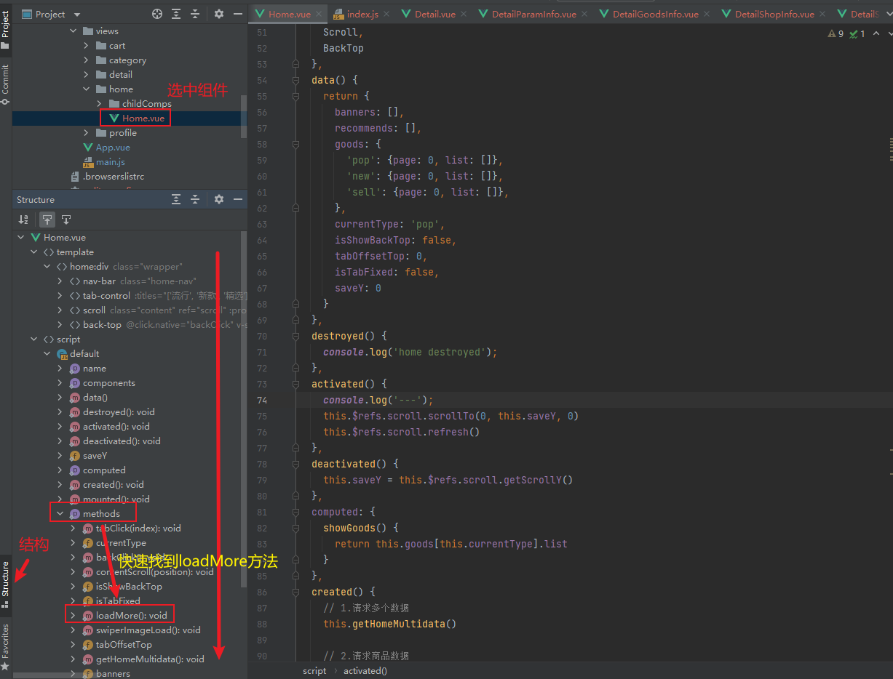

# 项目_08

## 滚动效果

### 底部导航不显示


```js
// 增加以下样式
#detail {
  position: relative;
  z-index: 9;
  background-color: #fff;
  height: 100vh;
}
```

### 导航增加样式

```js
.detail-nav {
  position: relative;
  z-index: 9;
  background-color: #fff;
}
```

### 滚动

```js
<template>
  <div id="detail">
    <detail-nav-bar class="detail-nav"/>
    <scroll class="content" ref="scroll">
      <detail-swiper :top-images="topImages"/>
      <detail-base-info :goods="goods"/>
      <detail-shop-info :shop="shop"/>
    </scroll>
  </div>
</template>

import Scroll from 'components/common/scroll/Scroll'

components: {
  Scroll
},
    
.content {
  height: calc(100% - 44px);
}
```

效果展示


### 商品详情数据

> 数据都在`detailInfo`中，直接获取就可以了
>
> 

在`childComps`，在其中创建`DetailGoodsInfo.vue`子组件

`DetailGoodsInfo.vue`

```js
<template>
  <div v-if="Object.keys(detailInfo).length !== 0" class="goods-info">
    <div class="info-desc clear-fix">
      <div class="start">
      </div>
      <div class="desc">{{detailInfo.desc}}</div>
      <div class="end"></div>
    </div>
    <div class="info-key">{{detailInfo.detailImage[0].key}}</div>
    <div class="info-list">
      
    </div>
  </div>
</template>

<script>
	export default {
	name: "DetailGoodsInfo",
    props: {
      detailInfo: {
        type: Object
      }
    },
    data() {
	  return {
		counter: 0,
        imagesLength: 0
      }
    },
    methods: {
	  imgLoad() {
        // 判断, 所有的图片都加载完了, 那么进行一次回调就可以了.
        if (++this.counter === this.imagesLength) {
          this.$emit('imageLoad');
        }
	  }
    },
    watch: {
	  detailInfo() {
	      // 获取图片的个数
	      this.imagesLength = this.detailInfo.detailImage[0].list.length
	    }
   	  }
	}
</script>

<style scoped>
  .goods-info {
    padding: 20px 0;
    border-bottom: 5px solid #f2f5f8;
  }

  .info-desc {
    padding: 0 15px;
  }

  .info-desc .start, .info-desc .end {
    width: 90px;
    height: 1px;
    background-color: #a3a3a5;
    position: relative;
  }

  .info-desc .start {
    float: left;
  }

  .info-desc .end {
    float: right;
  }

  .info-desc .start::before, .info-desc .end::after {
    content: '';
    position: absolute;
    width: 5px;
    height: 5px;
    background-color: #333;
    bottom: 0;
  }

  .info-desc .end::after {
    right: 0;
  }

  .info-desc .desc {
    padding: 15px 0;
    font-size: 14px;
  }

  .info-key {
    margin: 10px 0 10px 15px;
    color: #333;
    font-size: 15px;
  }

  .info-list img {
    width: 100%;
  }
</style>
```

> 对上面的特殊处理的部分：
>
> 1. 调用imageLoad的时候，我么设置了一个计数器，当图片数量全部加载完成的时候，我们才发通知给父组件
> 2. 使用watch去监听detailInfo对象的变化，去获取图片数量
> 3. 每生成一个img标签，@load表示图片加载完成，调用一次imageLoad方法，我们就会对counter计数器加一

在Detail.vue中

```js
<template>
  <div id="detail">
    <detail-nav-bar class="detail-nav"/>
    <scroll class="content" ref="scroll">
      <detail-swiper :top-images="topImages"/>
      <detail-base-info :goods="goods"/>
      <detail-shop-info :shop="shop"/>
      <detail-goods-info :detail-info="detailInfo" @imageLoad="imageLoad"/>
    </scroll>
  </div>
</template>

import DetailGoodsInfo from './childComps/DetailGoodsInfo'

components: {
  DetailGoodsInfo,
},
    
data() {
  return {
    detailInfo: {},
  }
},
    
created() {
    // 4.保存商品的详情数据
    this.detailInfo = data.detailInfo;
  })
},
    
methods: {
  imageLoad() {
    this.$refs.scroll.refresh()
  }
}
```

效果展示


### 商品参数

在network/detail.js中，整合数据

> 

```js
export class GoodsParam {
  constructor(info, rule) {
    // 注: images可能没有值(某些商品有值, 某些没有值)
    this.image = info.images ? info.images[0] : '';
    this.infos = info.set;
    this.sizes = rule.tables;
  }
}
```

在`childComps`，在其中创建`DetailGoodsInfo.vue`子组件

`DetailGoodsInfo.vue`

```js
<template>
  <div class="param-info" v-if="Object.keys(paramInfo).length !== 0">
    <table v-for="(table, index) in paramInfo.sizes"
           class="info-size" :key="index">
      <tr v-for="(tr, indey) in table" :key="indey">
        <td v-for="(td, indez) in tr" :key="indez">{{td}}</td>
      </tr>
    </table>
    <table class="info-param">
      <tr v-for="(info, index) in paramInfo.infos">
        <td class="info-param-key">{{info.key}}</td>
        <td class="param-value">{{info.value}}</td>
      </tr>
    </table>
    <div class="info-img" v-if="paramInfo.image.length !== 0">
      
    </div>
  </div>
</template>

<script>
	export default {
      name: "DetailParamInfo",
      props: {
	    paramInfo: {
		  type: Object,
          default() {
		    return {}
          }
        }
      }
	}
</script>

<style scoped>
  .param-info {
    padding: 20px 15px;
    font-size: 14px;
    border-bottom: 5px solid #f2f5f8;
  }

  .param-info table {
    width: 100%;
    border-collapse: collapse;
  }

  .param-info table tr {
    height: 42px;
  }

  .param-info table tr td {
    border-bottom: 1px solid rgba(100,100,100,.1);
  }

  .info-param-key {
    /*当value的数据量比较大的时候, 会挤到key,所以给一个固定的宽度*/
    width: 95px;
  }

  .info-param {
    border-top: 1px solid rgba(0,0,0,.1);
  }

  .param-value {
    color: #eb4868
  }

  .info-img img {
    width: 100%;
  }
</style>

```

在Detail.vue中

```js
<template>
  <div id="detail">
    <detail-nav-bar class="detail-nav"/>
    <scroll class="content" ref="scroll">
      <detail-swiper :top-images="topImages"/>
      <detail-base-info :goods="goods"/>
      <detail-shop-info :shop="shop"/>
      <detail-goods-info :detail-info="detailInfo" @imageLoad="imageLoad"/>
      <detail-param-info :param-info="paramInfo"/>
    </scroll>
  </div>
</template>

import DetailParamInfo from './childComps/DetailParamInfo'
import {GoodsParam} from "network/detail";

components: {
  DetailParamInfo,
},
data() {
  return {
    paramInfo: {}
  }
},
created() {
  // 5.获取参数的信息
  this.paramInfo = new GoodsParam(data.itemParams.info, data.itemParams.rule)
}
```

效果展示


webstorm的使用技巧



### 用户评价

数据简单直接在rate中获取即可

> 

在`childComps`，在其中创建`DetailCommentInfo.vue`子组件

`DetailCommentInfo.vue`

```js
<template>
  <div v-if="Object.keys(commentInfo).length !== 0" class="comment-info">
    <div class="info-header">
      <div class="header-title">用户评价</div>
      <div class="header-more">
        更多
        <i class="arrow-right"></i>
      </div>
    </div>
    <div class="info-user">
      
      <span>{{commentInfo.user.uname}}</span>
    </div>
    <div class="info-detail">
      <p>{{commentInfo.content}}</p>
      <div class="info-other">
        <span class="data">{{commentInfo.created | showDate}}</span>
        <span>{{commentInfo.style}}</span>
      </div>
      <div class="info-imgs">
        
      </div>
    </div>
  </div>
</template>

<script>
  import {formatDate} from "common/utils";

  export default {
    name: "DetailCommentInfo",
    props: {
      commentInfo: {
        type: Object,
        default() {
          return {};
        }
      }
    },
    filters: {
      showDate: function (value) {
        // 1.时间戳是秒,data需传毫秒
        let date = new Date(value * 1000);
        // 2.将data格式化 y年、M月、d日、h时、m分钟、s秒
        return formatDate(date, "yyyy/MM/dd");
      }
    }
  };
</script>

<style>
  .comment-info {
    padding: 5px 12px;
    color: #333;
    border-bottom: 5px solid #f2f5f8;
  }

  .info-header {
    height: 50px;
    line-height: 50px;
    border-bottom: 1px solid rgba(0, 0, 0, 0.1);
  }

  .header-title {
    float: left;
    font-size: 15px;
  }

  .header-more {
    float: right;
    margin-right: 10px;
    font-size: 13px;
  }

  .info-user {
    padding: 10px 0 5px;
  }

  .info-user img {
    width: 42px;
    height: 42px;
    border-radius: 50%;
  }

  .info-user span {
    position: relative;
    font-size: 15px;
    top: -15px;
    margin-left: 10px;
  }

  .info-detail {
    padding: 0 5px 15px;
  }

  .info-detail p {
    font-size: 14px;
    color: #777;
    line-height: 1.5;
  }

  .info-detail .info-other {
    font-size: 12px;
    color: #999;
    margin-top: 10px;
  }

  .info-other .date {
    margin-right: 8px;
  }

  .info-imgs {
    margin-top: 10px;
  }

  .info-imgs img {
    width: 70px;
    height: 70px;
    margin-right: 5px;
  }
</style>
```

> 知识点：
>
> - 服务器返回的时间一般是时间戳，需要我们将其变换样式`yyyy - mm -dd hh:mm:ss`的格式 
>   - 世界上有不同的时区，每个地方需要展示时间的不同，但是时间戳是相同的，后端返回时间戳，前端根据时间戳完成计算，显示当地时间

在utils.js中定义formatDate函数处理时间

```js
//时间转换函数
export function formatDate(date, fmt) {
  // 1.获取年份(.tes(fmt)是匹配字符串)
  // 2.RegExp.$1是匹配到的结果
  // 3.将正则匹配结果替换
  // 4.将数据截取(最多4位,超过截取)
  if (/(y+)/.test(fmt)) {
    fmt = fmt.replace(RegExp.$1, (date.getFullYear() + '').substr(4 - RegExp.$1.length));
  }
  // 2.获取
  let o = {
    'M+': date.getMonth() + 1,
    'd+': date.getDate(),
    'h+': date.getHours(),
    'm+': date.getMinutes(),
    's+': date.getSeconds()
  };
  for (let k in o) {
    if (new RegExp(`(${k})`).test(fmt)) {
      let str = o[k] + '';
      fmt = fmt.replace(RegExp.$1, (RegExp.$1.length === 1) ? str : padLeftZero(str));
    }
  }
  return fmt;
}

function padLeftZero(str) {
  // 截取时间不足补零
  return ('00' + str).substr(str.length);
}
```

在Detail.vue中

```js
<template>
  <div id="detail">
    <detail-nav-bar class="detail-nav"/>
    <scroll class="content" ref="scroll">
      <detail-swiper :top-images="topImages"/>
      <detail-base-info :goods="goods"/>
      <detail-shop-info :shop="shop"/>
      <detail-goods-info :detail-info="detailInfo" @imageLoad="imageLoad"/>
      <detail-param-info :param-info="paramInfo"/>
      <detail-comment-info :comment-info="commentInfo" ref="comment"/>
    </scroll>
  </div>
</template>

import DetailCommentInfo from "./childComps/DetailCommentInfo";

components: {
  DetailCommentInfo,
},
data() {
  return {
    commentInfo: {},
  }
},
created() {
  // 获取评论信息
  if (data.rate.cRate !== 0) {
    this.commentInfo = data.rate.list[0]
  }
}
```

效果展示


### 推荐信息

在network/details.js中对推荐数据进行请求

```js
export function getRecommend() {
  return request({
    url:'/recommend'
  })
}
```

请求回来的信息如下

> 

如图所示，推荐数据的布局和我们之前的goods组件的布局一样，我们直接在Detail.vue中进行引用

```js
<template>
  <div id="detail">
    <detail-nav-bar class="detail-nav"/>
    <scroll class="content" ref="scroll">
      <detail-swiper :top-images="topImages"/>
      <detail-base-info :goods="goods"/>
      <detail-shop-info :shop="shop"/>
      <detail-goods-info :detail-info="detailInfo" @imageLoad="imageLoad"/>
      <detail-param-info :param-info="paramInfo"/>
      <detail-comment-info :comment-info="commentInfo" ref="comment"/>
      <goods-list :goods="recommends" ref="goods_list"/>
    </scroll>
  </div>
</template>
import GoodsList from "components/content/goods/GoodsList";
import {getRecommend} from "network/detail";
components: {
  GoodsList,
},

data() {
  return {
    recommends: [],
  }
},

created() {
  // 获取数据
  getRecommend().then(res => {
    console.log(res)
    this.recommends = res.data.list
  }, err => {
    console.log(err);
  })
},
```

运行报错


这个错误是说：在GoodsListItem组件中读取不到img属性


将goodslistItem中增加获取数据源

```js


// 增加计算属性(从多个数据源的位置获取数据)
computed:{
  showImage(){
     return this.goodsItem.image ||  this.goodsItem.img || this.goodsItem.show.img
  }
},
```

推荐数据可以正常展示


#### 隐藏问题

> - 问题原因：
>
>   - 在GoodsListItem中我们对每张图片的加载完成进行了监听，@load = imageLoad，这个事件监听会去通知Home组件，图片加载完成需要进行refresh的操作了
>
>   - 但是我们在detail页面的推荐商品部分也使用了GoodsListItem组件，我们在图片加载完成去通知home组件就不太合适，需要使得我们自己detail组件进行refresh刷新
>
> - 解决办法：
>   - 路由解决(判断路径)
>     - 路径中有`home`，对home组件通知进行完成refresh的操作
>     - 路径中有`detail`，对detail组件进行通知完成refresh的操作
>   - 总线方式
>     - 在home组件离开的时候，我们取消掉imageLoad事件的通知
>     - `this.$bus.$off('imageLoad',事件处理函数)`

home.vue中代码

```js
data() {
  return {
    itemImgListener:null
  }
},

deactivated() {
  this.saveY = this.$refs.scroll.getScrollY()

  // 取消imageLoad事件监听
  this.$bus.$off('imageLoad',this.itemImgListener)
},
    
mounted() {
  // 1.图片加载完成的事件监听
  const refresh = debounce(this.$refs.scroll.refresh, 50)
  this.itemImgListener = () => {
    refresh()
  }
  this.$bus.$on('itemImageLoad', this.itemImgListener)
},
```

在Detail中实现思路和上面的home是一样的

```js
data() {
  return {
    itemImgListener:null
  }
},

// 因为keep-alive将详情页剔除了，所以没有deactivated，需要使用destroyed
destroyed() {
    this.$bus.$off('itmImgLoad', this.itemImgListener)
},
    
mounted() {
  // 1.图片加载完成的事件监听
  const refresh = debounce(this.$refs.scroll.refresh, 50)
  this.itemImgListener = () => {
    refresh()
  }
  this.$bus.$on('itemImageLoad', this.itemImgListener)
},
```

### 混入

使用mixin(`混入`)的方式

在commen下新建一个mixin.js的方法

> 官方示例代码
>
> ```js
> const mixin = {
>   created() {
>     console.log(1)
>   }
> }
> 
> createApp({
>   created() {
>     console.log(2)
>   },
>   mixins: [mixin]
> })
> 
> // => 1
> // => 2
> ```

将抽取的代码放在mixin.js中

```js
import {debounce} from "./utils";

export const itemListenerMixin = {
  data(){
    return{
      itemImgListener:null
    }
  },
  mounted() {
    const refresh = debounce(this.$refs.scroll.refresh, 800);
    this.itemImgListener = () => {
      refresh()
    }
    this.$bus.$on('itemImageLoad', this.itemImgListener)
  }
}
```

对home组件进行修改

```js
// debounce的导入删除掉

// 导入
import {itemListenerMixin} from "common/mixin";

mixins: [itemListenerMixin],
    
deactivated() {
  this.saveY = this.$refs.scroll.getScrollY()

  // 取消imageLoad事件监听
  this.$bus.$off('imageLoad',this.itemImgListener)
},
  
// 可以不写
mounted() {

},
```

对detail组件进行修改

```js
import {itemListenerMixin} from "common/mixin";
mixins: [itemListenerMixin],

destroyed() {
  this.$bus.$off('itmImgLoad', this.itemImgListener)
},

// 可以不写
mounted() {

},
```

