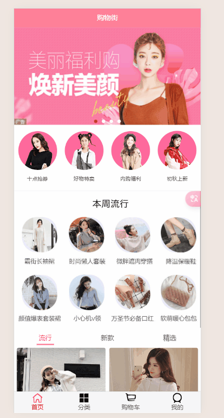
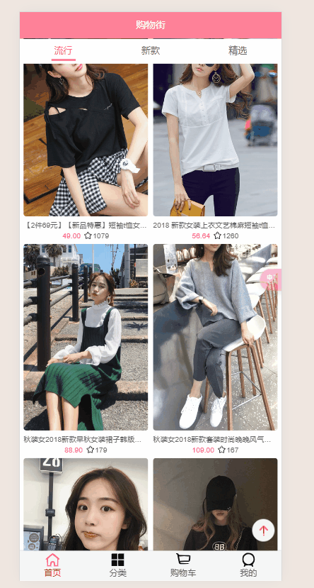
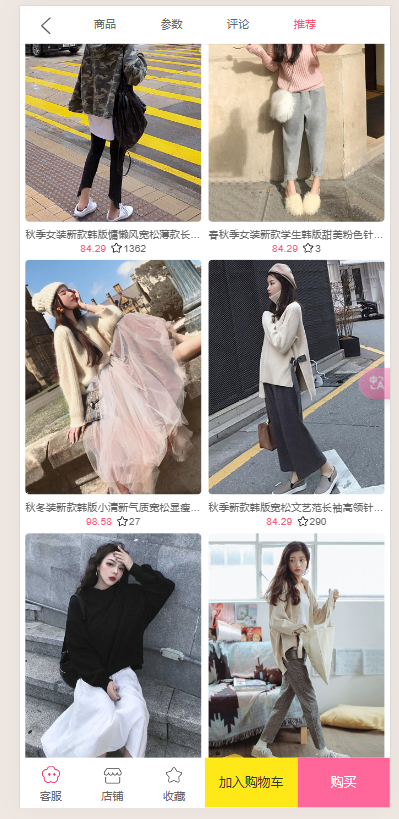
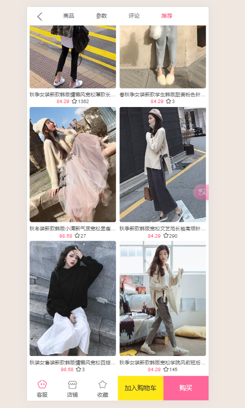

# 项目_09

## 联动效果

### 点击标题滚动到对应主题

> 注意事项：
>
> 属性传值的时候：topImage     传入值：top-image  
>
> - 可能忽略大小写，传入值最终都转化成topimage，使用topImage可能找不到值
>
> 监听事件：直接使用驼峰没有影响

在DetailNavBar.vue中添加点击事件通知父组件

```js
methods: {
  titleClick(index) {
    this.currentIndex = index
    this.$emit('ShowNav',index)
  },
}
```

在Detail中对监听到的事件处理

```js
data() {
  return {
    themeTopYs: [0,1000,2000,3000],
  }
},

methods: {
  ShowNav(index) {
    // console.log(index);
    // 点击商品数据显示位置
    this.PageHeight = -this.themeTopYs[index]
    // console.log(this.themeTopYs);
    this.$refs.scroll.scrollTo(0, this.PageHeight, 100)
  },
},
```

我们先将themeTopYs的值写死，看下运行效果



### 得到每个主题的真实位置信息

其实就是获取各个组件的offsetTop，将其加入到themeTopYs列表中即可

```js
<detail-param-info :param-info="paramInfo" ref="detparam"/>
<detail-comment-info :comment-info="commentInfo" ref="comment"/>
<goods-list :goods="recommends" ref="goods_list"/>

methods: {
  ...mapActions(['addCart']),
  imageLoad() {
    // 刷新scroll对象
    this.$refs.scroll.refresh()
    this.themeTopYs = []
    this.themeTopYs.push(0);
    this.themeTopYs.push(this.$refs.detparam.$el.offsetTop);
    this.themeTopYs.push(this.$refs.comment.$el.offsetTop);
    this.themeTopYs.push(this.$refs.goods_list.$el.offsetTop);
    console.log(this.themeTopYs);
  },
},
```

效果展示如下



> 存在问题，还是因为图片没加载完成，导致位置信息记录的不对，最终跳转位置不对
>
> 
>
> - `this.$refs.detparam.$el.xxxx` 不能放在mounted中，是因为挂载的时候，有时候还没有数据，直接调用`$el`，可能拿不到数据，进而拿不到元素
> - 放在拿到数据之后，也不行，因为数据渲染到界面上还是需要一定时间，还拿不到元素
> - 放在updated中也不好，因为只要更新就会调用，太频繁，能拿到数据，但是数据拿到的可能不对
> - 可以使用`this.$nextTick(()=>{})` ，这个函数的作用就是监听所有dom都渲染好，调用回调函数处理，保证了一定有值，但是不一定正确(图片未加载完成，高度不对)
> - 放在imageLoad中，放在监听图片加载完成的函数中，此时的数据就是真实的位置信息
>
> 我们在前面对所有图片加载完成发送一次父组件通知，在这就不使用防抖操作了，两个效果一样

### 滚动显示对应标题

```js
<detail-nav-bar class="detail-nav" @ShowNav="ShowNav" ref="dnb"/>

data() {
  return {
    currentIndex: 0,
  }
},

methods: {
  Show_Scroll(position) {
    const positionY = -position.y
    // 图片滑动展示颜色(还有一种方法是将列表添加一个最大值，之后就不需要判断等于的情况了)
    for (let i = 0; i <= this.themeTopYs.length - 1; i++) {
      if ((this.currentIndex !== i && positionY >= this.themeTopYs[i])
          && (positionY < this.themeTopYs[i + 1] || i === this.themeTopYs.length - 1)) {
        this.currentIndex = i;
        this.$refs.dnb.$data.currentIndex = this.currentIndex;
      }
    }
  },
},
```

> 注意比较的问题：
>
> - 上下界都要比较
> - 数组越界问题
>
> `this.$refs.dnb.$data.currentIndex = this.currentIndex;`  注意`$data`的使用
>
> 假设themeTopYs = [0, 7777, 10000, 12000]
>
> 判断的优化：
>
> positionY在 0 到 7777 之间 ，index = 0
>
> positionY在 7777 到 10000 之间 ，index = 1
>
> positionY在 10000 到 12000 之间 ，index = 2
>
> positionY在 12000 到 `无穷大` 之间 ，index = 3
>
> 使用Number.MAX_VALUE
>
> 将其重新 themeTopYs = [0, 7777, 10000, 12000, Number.MAX_VALUE]
>
> ```
> positionY < this.themeTopYs[i + 1] && positionY >= this.themeTopYs[i]
> ```

效果如图：


在详情页面刷新界面，home不会停留，回到顶部的原因是：

- 刷新，导致所有资源全部重新创建，数据重新请求，home被冲新创建了，所以原始位置不会保留，回到了顶部

## 底部工具栏

### 封装

在`childComps`，在其中创建`detailBottomBar.vue`子组件

`detailBottomBar.vue`

```js
<template>
  <div class="bottom-bar">
    <div class="bar-item bar-left">
      <div>
        <i class="icon service"></i>
        <span class="text">客服</span>
      </div>
      <div>
        <i class="icon shop"></i>
        <span class="text">店铺</span>
      </div>
      <div>
        <i class="icon select"></i>
        <span class="text">收藏</span>
      </div>
    </div>
    <div class="bar-item bar-right">
      <div class="cart" @click="addToCart">加入购物车</div>
      <div class="buy">购买</div>
    </div>
  </div>
</template>

<script>
export default {
  name: "detailBottomBar",
  methods: {
    addToCart() {
      this.$emit("addCart");
    }
  }
};
</script>

<style scoped>
.bottom-bar {
  height: 58px;
  position: fixed;
  background-color: #fff;
  /*bottom: 58px;*/
  left: 0;
  right: 0;
  bottom: 0;
  display: flex;
  text-align: center;
  width: 100%;
}

.bar-item {
  flex: 1;
  display: flex;
}

.bar-item > div {
  flex: 1;
}

.bar-left .text {
  font-size: 13px;
}

.bar-left .icon {
  display: block;
  width: 22px;
  height: 22px;
  margin: 10px auto 3px;
  background: url("~assets/img/detail/detail_bottom.png") 0 0/100%;
}

.bar-left .service {
  background-position: 0 -54px;
}

.bar-left .shop {
  background-position: 0 -98px;
}

.bar-right {
  font-size: 15px;
  color: #fff;
  line-height: 58px;
}

.bar-right .cart {
  background-color: #ffe817;
  color: #333;
}

.bar-right .buy {
  background-color: #f69;
}
</style>
```

在Detail.vue中

```js
<template>
  <div id="detail">
    <detail-nav-bar class="detail-nav" @ShowNav="ShowNav" ref="dnb"/>
    <scroll class="content" ref="scroll" @scroll="Show_Scroll" :probe-type="3" :pull-up-load="true">
      <detail-swiper :top-images="topImages"/>
      <detail-base-info :goods="goods"/>
      <detail-shop-info :shop="shop"/>
      <detail-goods-info :detail-info="detailInfo" @imageLoad="imageLoad"/>
      <detail-param-info :param-info="paramInfo" ref="detparam"/>
      <detail-comment-info :comment-info="commentInfo" ref="comment"/>
      <goods-list :goods="recommends" ref="goods_list"/>
    </scroll>
    <detail-bottom-bar/>
  </div>
</template>

import DetailBottomBar from "./childComps/DetailBottomBar";

components: {
  DetailBottomBar,
},
    
.detail-nav {
  position: relative;
  z-index: 1003;
  background-color: #fff;
}
```

展示效果



这里出现了遮挡，我们把detail.vue中的content的大小改一下就行了

```js
.content {
  height: calc(100% - 44px - 58px);// 44 顶部导航 58 底部导航 一共102
}
```

修复后的效果下：



> 但是存在一个问题：
>
> 我的bottom-bar会飞，应该是reletive的问题
>
> 老师的代码中使用relative的方式导致bottom-bar会向上移动，改成fixed 并且 left = 0;right=0;bottom=0;

## 回到顶部

因为和主页的回到顶部有太多相同的方法，直接抽取代码到mixin中

```js
import BackTop from "components/content/backTop/BackTop";
export const backTopMixin = {
  components:{
    BackTop
  },
  data(){
    return{
      isShowBackTop:false
    }
  },
  methods:{
    backClick() {
      this.$refs.scroll.scrollTo(0, 0)
    }
  }
}
```

在Detail中进行引用

```js
<back-top @click.native="backClick" v-show="isShowBackTop"/>

import {itemListenerMixin,backTopMixin} from "common/mixin"
import {BACK_POSITION} from "common/const.js";

mixins: [itemListenerMixin,backTopMixin],
    
Show_Scroll(position) {
  const positionY = -position.y
  // 图片滑动展示颜色(还有一种方法是将列表添加一个最大值，之后就不需要判断等于的情况了)
  for (let i = 0; i <= this.themeTopYs.length - 1; i++) {
    if (
      (this.currentIndex !== i &&
        positionY >= this.themeTopYs[i])
      &&
      (positionY < this.themeTopYs[i + 1] ||
        i === this.themeTopYs.length - 1)
    ) {
      this.currentIndex = i;
      this.$refs.dnb.$data.currentIndex = this.currentIndex;
    }
  }
  this.isShowBackTop = (positionY) > BACK_POSITION
},
```

将常量定义在commen/const.js中

```js
export const BACK_POSITION = 1000
```

同时抽取了mixin后home的代码也需要删减

```js
import {itemListenerMixin,backTopMixin} from "common/mixin";
import {BACK_POSITION} from "@/common/const";

mixins: [itemListenerMixin,backTopMixin],
    
contentScroll(position) {
  // 1.判断BackTop是否显示
  this.isShowBackTop = (-position.y) > BACK_POSITION

  // 2.决定tabControl是否吸顶(position: fixed)
  this.isTabFixed = (-position.y) > this.tabOffsetTop
},
```

效果展示


