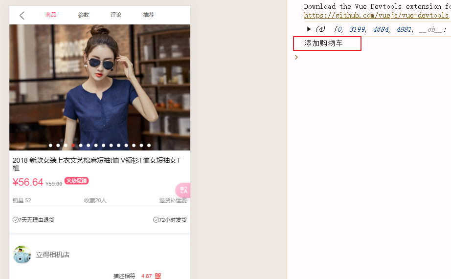
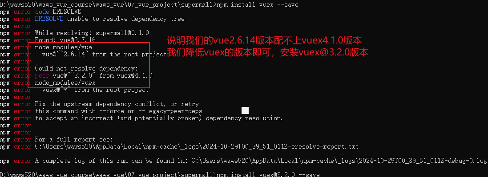
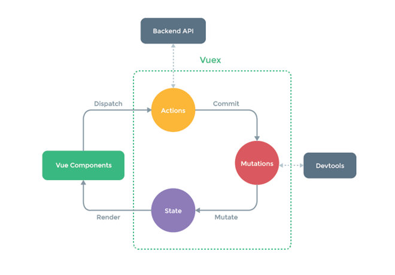
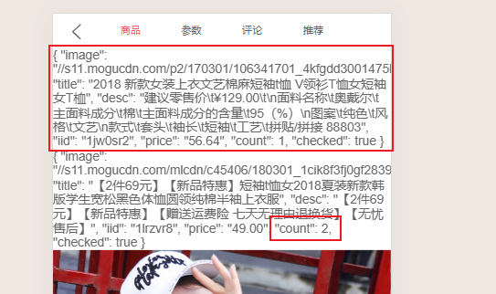
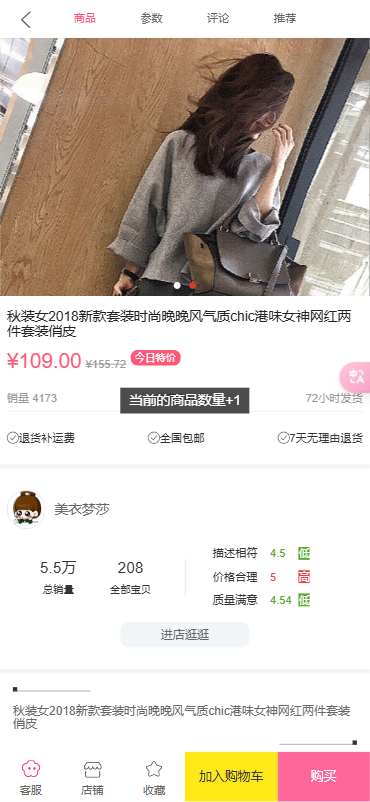
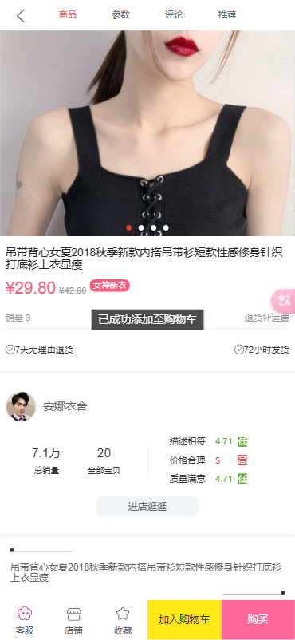
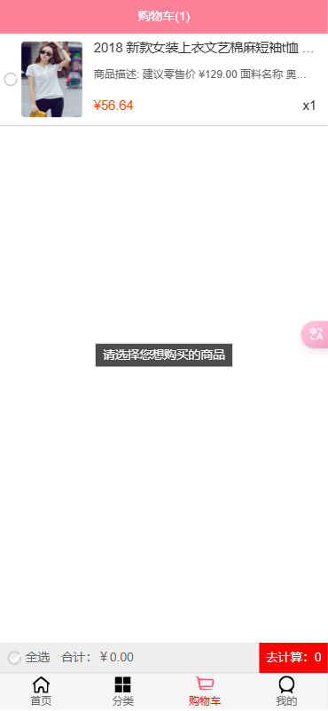
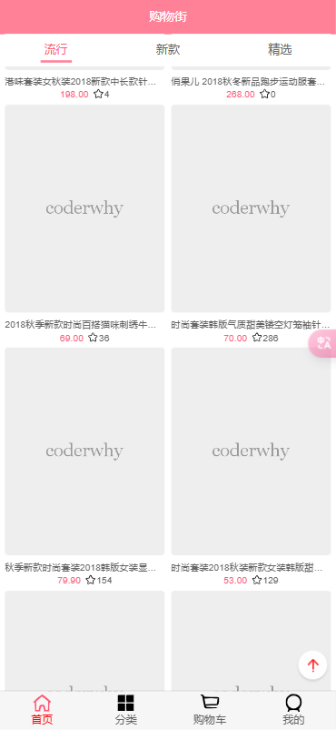
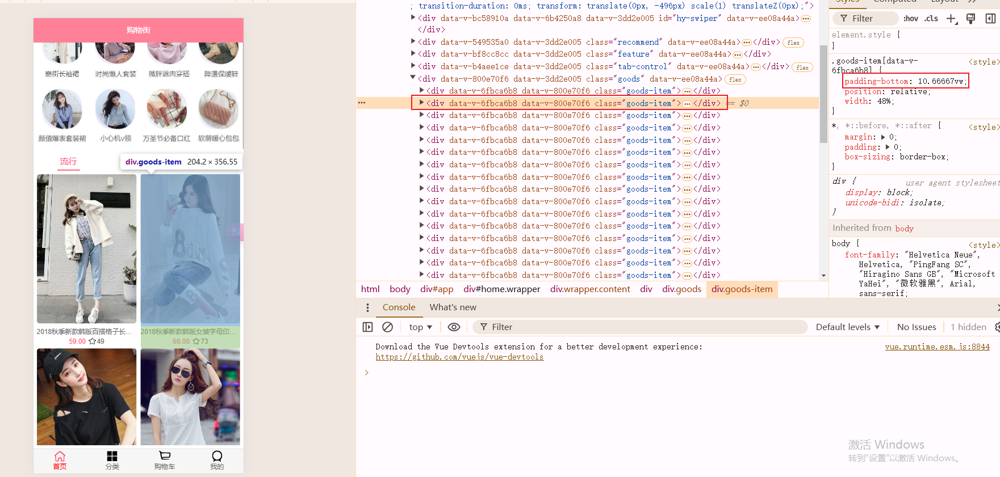
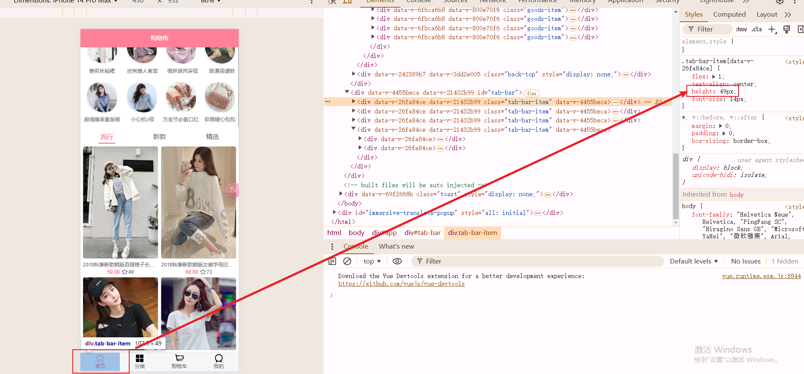

# 项目_10

## 购物车

### 添加购物车

在detailBottomBar子组件中添加点击事件，通知父组件

```js
<div class="cart" @click="addToCart">加入购物车</div>

methods: {
  addToCart() {
    this.$emit("addCart");
  }
}
```

在Detial父组件中添加监听

```js
<detail-bottom-bar @addCart="addToCart"/>
    
addToCart() {
  console.log('添加购物车');
} 
```

成功监听到事件



添加

```js
addToCart() {
  const product = {}
  product.image = this.topImages[0];
  product.title = this.goods.title;
  product.desc = this.goods.desc;
  product.iid = this.iid;
  product.price = this.goods.realPrice;
} 
```

#### Vuex的引入

将我们的购物车数据加入到vuex中，实现统一管理，当有不同的页面中也有添加购物车或者需要展示购物车中数据的时候，了我们可以直接见他们放入到vuex或者从vuex中取出来

1. 安装vuex

```js
npm install vuex@3.2.0 --save
```

直接`npm install vuex --save`会报错



2. 引入vuex
   - 在store文件夹中，建立index.js文件

```js
import Vuex from 'vuex'
import Vue from 'vue'
// 1.安装插件

Vue.use(Vuex)

// 2.创建store对象
const state = {
  cartList: []
}


const store = new Vuex.Store({
  state,
  mutations,
  actions,
  getters
})

// 挂载

export default store
```

在main.js中尽行导入

```js
import store from './store';

new Vue({
  router,
  store,
  render: h => h(App),
}).$mount('#app')
```

对index.js进行编写

```js
import Vuex from 'vuex'
import Vue from 'vue'
// 1.安装插件

Vue.use(Vuex)

// 2.创建store对象
const state = {
  cartList: []
}


const store = new Vuex.Store({
  state,
  mutations:{
    addCounter(state, payload) {
      payload.count++
    },
    addToCart(state, payload) {
      payload.checked = true
      state.cartList.push(payload)
    }
  },
  actions:{
    addCart(context,payload){
      let product = context.state.cartList.find(item => item.iid === payload.iid)
      // 购物车添加数量+1
      if (product) {
        context.commit(ADD_COUNTER, product)
      } else {
        payload.count = 1
        context.commit(ADD_TO_CART,payload)
      }
    }
  },
})

// 挂载

export default store
```

mutations

- mutations唯一的目标就是修改state的状态
- mutations中的每个方法尽可能完成的事件比较单一
- 因为我们之前的设计中将存在商品的数量加一和新商品添加进入购物车放在了一个方法中，相当于一个mutations监控两件事情，违背了单一修改原则
- 所以我们将ADD_COUNTER,ADD_TO_CART分开来进行处理
  - 将ADD_COUNTER,ADD_TO_CART方法放在actions中实现，然后将状态放在mutations中取更新
  - 就是下图的具象化操作
  - 

在detail中调用

```js
<template>
  <div id="detail">
    <detail-nav-bar class="detail-nav" @ShowNav="ShowNav" ref="dnb"/>
    <scroll class="content" ref="scroll" @scroll="Show_Scroll" :probe-type="3" :pull-up-load="true">
      // 对添加购物车数据进行展示
      <ul>
        <li v-for="item in $store.state.cartList">{{item}}</li>
      </ul>
      <detail-swiper :top-images="topImages"/>
      <detail-base-info :goods="goods"/>
      <detail-shop-info :shop="shop"/>
      <detail-goods-info :detail-info="detailInfo" @imageLoad="imageLoad"/>
      <detail-param-info :param-info="paramInfo" ref="detparam"/>
      <detail-comment-info :comment-info="commentInfo" ref="comment"/>
      <goods-list :goods="recommends" ref="goods_list"/>
    </scroll>
    <detail-bottom-bar @addCart="addToCart"/>
    <back-top @click.native="backClick" v-show="isShowBackTop"/>
  </div>
</template>

addToCart() {
    const product = {}
    product.image = this.topImages[0];
    product.title = this.goods.title;
    product.desc = this.goods.desc;
    product.iid = this.iid;
    product.price = this.goods.realPrice;
    this.$store.dispatch('addCart',product)
}
```

效果展示




#### 将index中代码重构

对index.js代码进行抽离

```js
import Vuex from 'vuex'
import Vue from 'vue'
import mutations from "./mutaions";
import actions from "./actions"
import getters from "./getters";
// 1.安装插件

Vue.use(Vuex)

// 2.创建store对象
const state = {
  cartList: []
}


const store = new Vuex.Store({
  state,
  mutations,
  actions,
  getters
})

// 挂载

export default store
```

将getters、mutations、actions分别构建js文件，实现分离

getter.js

```js
export default {
  cartLength(state){
    return state.cartList.length
  },
  cartList(state){
    return state.cartList
  }
}
```

actions.js

```js
import { ADD_COUNTER,ADD_TO_CART } from "./mutation-types"

export default {
  addCart(context, payload) {
      let product = context.state.cartList.find(item => item.iid === payload.iid)
      // 购物车添加数量+1
      if (product) {
        context.commit(ADD_COUNTER, product)
      } else {
        payload.count = 1
        context.commit(ADD_TO_CART,payload)
      }
  }
}
```

mutations.js

```js
import { ADD_COUNTER,ADD_TO_CART } from "./mutation-types"

export default {
  // 将添加数据和记录数据分开
  [ADD_COUNTER](state, payload) {
    payload.count++
  },
  [ADD_TO_CART](state, payload) {
    payload.checked = true
    state.cartList.push(payload)
  }
}
```

mutations-type.js 存储常量

```js
export const ADD_COUNTER = "addCounter"
export const ADD_TO_CART = "addToCart"
```

### 购物车界面

#### 导航栏

Cart.vue中进行

```js
<template>
  <div class="cart">
    <!--    导航-->
    <nav-bar class="nav-bar">
      <div slot="center">购物车({{cartLength}})</div>
    </nav-bar>

  </div>
</template>

<script>
import NavBar from "components/common/navbar/NavBar";
import {mapGetters} from 'vuex'

export default {
  name: "Cart",
  components: {
    NavBar
  },
  computed: {
    ...mapGetters([
      'cartLength', 'cartList'
    ])
  }
}
</script>

<style scoped>
.nav-bar {
  background-color: var(--color-tint);
  color: #fff;
}
.cart{
  height: 100vh;
}
</style>
```

> 知识点：
>
> - `import {mapGetters} from 'vuex'` 将vuex中的getters中的属性变量导入到计算属性中，可以向计算属性一样调用
> - `computed: { ...mapGetters(['cartLength', 'cartList'])}`
>
> `mapGetters` 辅助函数
>
> `mapGetters` 辅助函数仅仅是将 store 中的 getter 映射到局部计算属性：
>
> ```js
> import { mapGetters } from 'vuex'
> 
> export default {
>   // ...
>   computed: {
>   // 使用对象展开运算符将 getter 混入 computed 对象中
>     ...mapGetters([
>       'doneTodosCount',
>       'anotherGetter',
>       // ...
>     ])
>   }
> }
> ```
>
> 如果你想将一个 getter 属性另取一个名字，使用对象形式：
>
> ```js
> ...mapGetters({
>   // 把 `this.doneCount` 映射为 `this.$store.getters.doneTodosCount`
>   doneCount: 'doneTodosCount'
> })
> ```
效果展示


#### 购物车数据展示

> 比较简单，和之前很多位置相同，这里直接组合展示了，遇到的新的知识点单独说明

在`childComps`，在其中创建`CartList.vue`子组件

`CartList.vue`

```js
<template>
  <div class="cart-list">
    <scroll class="content" ref="scroll">
      <cart-list-item v-for="(item,index) in cartList"
                      :product="item"
                      :key="index"/>
    </scroll>
    <cart-bottom-bar/>
  </div>
</template>

<script>
  import {mapGetters} from 'vuex'
  import Scroll from "components/common/scroll/Scroll";
  import CartListItem from "./CartListItem";
  import CartBottomBar from "./CartBottomBar";

  export default {
    name: "CartList",
    computed: {
      ...mapGetters(['cartList'])
    },
    components: {
      CartBottomBar,
      CartListItem,
      Scroll
    },
    activated() {
      this.$refs.scroll.refresh()
    },
  }
</script>

<style scoped>
  .cart-list {
    height: calc(100% - 44px - 49px - 40px);
  }

  .content {
    height: 100%;
    overflow: hidden;
  }
</style>
```

在`childComps`，在其中创建`CartListItem.vue`子组件

`CartListItem.vue`

```js
<template>
  <div>
    <div id="shop-item">
      <div class="item-selector">
        <check-button
          @checkBtnClick="checkBtnClick"
          :checked="product.checked"></check-button>
      </div>
      <div class="item-img">
        
      </div>
      <div class="item-info">
        <div class="item-title">{{product.title}}</div>
        <div class="item-desc">商品描述: {{product.desc}}</div>
        <div class="info-bottom">
          <div class="item-price left">¥{{product.price}}</div>
          <div class="item-count right">x{{product.count}}</div>
        </div>
      </div>
    </div>

  </div>
</template>

<script>
  import CheckButton from "./CheckButton";
  export default {
    name: "CartListItem",
    components: {CheckButton},
    props: {
      product: {
        type: Object,
        default() {
          return {}
        }
      }
    },
    methods:{
      checkBtnClick(){
        this.product.checked = !this.product.checked
      }
    }
  }
</script>

<style scoped>
  #shop-item {
    width: 100%;
    display: flex;
    font-size: 0;
    padding: 5px;
    border-bottom: 1px solid #ccc;
  }

  .item-selector {
    width: 14%;
    display: flex;
    justify-content: center;
    align-items: center;
  }

  .item-title,
  .item-desc {
    overflow: hidden;
    white-space: nowrap;
    text-overflow: ellipsis;
  }

  .item-img {
    padding: 5px;
    /*border: 1px solid #ccc;*/
  }

  .item-img img {
    width: 80px;
    height: 100px;
    display: block;
    border-radius: 5px;
  }

  .item-info {
    font-size: 17px;
    color: #333;
    padding: 5px 10px;
    position: relative;
    overflow: hidden;
  }

  .item-info .item-desc {
    font-size: 14px;
    color: #666;
    margin-top: 15px;
  }

  .info-bottom {
    margin-top: 10px;
    position: absolute;
    bottom: 10px;
    left: 10px;
    right: 10px;
  }

  .info-bottom .item-price {
    color: orangered;
  }
</style>
```

在`childComps`，在其中创建`CartListItem.vue`子组件

`CartListItem.vue`

```js
<template>
  <div class="bottom-bar">
    <div class="check-content">
      <check-button
        :checked="isSelectAll"
        class="check-button"
        @click.native="ClickAll()"/>
      <span>全选</span>
    </div>
    <div class="total-price">
      合计：{{totalPrice}}
    </div>
    <div class="calculate" @click="calcClick()">
      去计算：{{CheckLength}}
    </div>
  </div>
</template>

<script>
  import CheckButton from "./CheckButton";
  import {mapGetters} from 'vuex';

  export default {
    name: "CartBottomBar",
    components: {
      CheckButton
    },
    computed: {
      ...mapGetters(['cartList']),
      totalPrice() {

        return "￥" + this.cartList.filter(item => {
          return item.checked
        }).reduce((preValue, item) => {
          return preValue + item.price * item.count
        }, 0).toFixed(2)
      },
      CheckLength() {
        return this.cartList.filter(item => item.checked).length
      },
      isSelectAll() {
        if (this.cartList.length === 0) return false
        //1.通过filter函数
        // return !(this.cartList.filter(item=>!item.checked).length)
        //2.通过find函数
        return !this.cartList.find(item => !item.checked)
        //3.通过普通遍历
        // for (let item of this.cartList) {
        //   if (!item.checked) {
        //     return false
        //   }
        // }
        // return true
      },
      isPurchaseALL() {
        return !this.cartList.find(item => item.checked)
      }

    },
    methods: {
      ClickAll() {
        if (this.isSelectAll) {
          this.cartList.forEach(item => item.checked = false)
        } else {
          this.cartList.filter(item => {
            if (!item.checked) {
              item.checked = true
            }
          })
        }
      },
      calcClick() {
        if (this.isPurchaseALL) {
          this.$toast.show('请选择您想购买的商品')
        }
      }
    }
  }
</script>

<style scoped>
  .bottom-bar {
    position: relative;
    display: flex;
    height: 40px;
    line-height: 40px;
    background-color: #eee;
  }

  .check-content {
    display: flex;
    align-items: center;
    width: 80px;

  }

  .check-button {
    width: 19px;
    height: 19px;
    line-height: 15px;
    margin-left: 10px;
    margin-right: 4px;
  }

  .total-price {
    flex: 1;
  }

  .calculate {
    width: 90px;
    background-color: red;
    color: #ffffff;
    text-align: center;
  }
</style>
```

在`childComps`，在其中创建`CheckButton.vue`子组件

`CheckButton.vue`

```js
<template>
  <div>
    <div class="icon-selector"
         :class="{'selector-active': checked}"
         @click="selectItem">
      
    </div>
  </div>
</template>

<script>
  export default {
    name: "CheckButton",
    props:{
      checked:{
        default:false,
        type:Boolean
      }
    },
    methods: {
      selectItem() {
        this.$emit("checkBtnClick");
      }
    }
  }
</script>

<style scoped>
  .icon-selector {
    position: relative;
    margin: 0;
    width: 18px;
    height: 18px;
    border-radius: 50%;
    border: 2px solid #ccc;
    cursor: pointer;
  }

  .selector-active {
    background-color: #ff8198;
    border-color: #ff8198;
  }
</style>
```

在Cart.vue中进行展示

```js
<cart-list/>
    
import CartList from "./childComps/CartList";

components: {
  CartList,
},
```

效果展示(计数、全选联动、加入购物车、滚动效果均正常)


##### 知识点

> - 选中不选中的样式，我们设置了一个border-color(巧妙设计)
>
>   - 当我们不选中的时候，我们的border-color是灰色，显示有个区域没有被选中可以进行点选
>   - 当我们选中的时候，我们的border-color是白色，只显示选中的背景颜色就行了
>
> - 添加购物车成功，我们**弹窗提示**
>
>   - 使用`Tosat`(核心：**插件封装**)
>
>   - 在components/commen下面新建index.js 和 Toast.vue
>
>   - 核心思路就是：之前分析router的时候，我们看过源码，在Vue.use(xxxx)中其实是会去调用install方法，然后在Vue的实例原型上添加组件Vue.prototype.xxxx = xxx
>
>   - 我们的方法就是仿照router的
>
>   - 插件代码
>
>     - ```js
>       <template>
>         <div class="toast" v-show="isShow">
>           <div>{{message}}</div>
>         </div>
>       </template>
>       
>       <script>
>         export default {
>           name: "Toast",
>           props:{
>             // message:{
>             //   type:String,
>             //   default:""
>             // },
>             // isShow:{
>             //   type: Boolean,
>             //   default: false
>             // }
>           },
>           data(){
>             return {
>               message:'',
>               isShow:false
>             }
>           },
>           methods:{
>             show(message,duration=1500){
>               this.isShow = true;
>               this.message = message
>               setTimeout(()=>{
>                 this.isShow = false;
>                 this.message = ''
>               },duration)
>             }
>           }
>         }
>       </script>
>       
>       <style scoped>
>         .toast{
>           position: fixed;
>           top: 50%;
>           left: 50%;
>           padding: 6px 10px;
>           transform: translate(-50%,-50%);
>           background-color: rgba(0,0,0,.7);
>           color: #fff;
>           z-index: 1100;
>         }
>       
>       </style>
>       ```
>
>   - index.js注册
>
>     - ```js
>       import Toast from "./Toast";
>       
>       const obj = {}
>       
>       obj.install = function (Vue) {
>         // 对象指向虽然正确，但是template的部分不能渲染，需要组件构造器完成
>         Vue.prototype.$toast = Toast
>       }
>       
>       export default obj
>       ```
>
>     - ```js
>       // 完整代码
>       import Toast from "./Toast";
>       
>       const obj = {}
>       
>       obj.install = function (Vue) {
>         // 1.创建组件构造器
>         const toastContrustor = Vue.extend(Toast)
>         // 2.new的方式，根据组件构造器，创建出组件对象
>         const toast = new toastContrustor()
>         // 3.将组件对象手动挂载到某一元素上
>         toast.$mount(document.createElement('div'))
>         // 使用$el将所有template的元素添加到document.body中
>         document.body.appendChild(toast.$el)
>         // 在Vue原型链上添加$toast指向toast组件
>         Vue.prototype.$toast = toast
>       }
>       
>       export default obj
>       ```
>
>   - 在main.js中注册
>
>     - ```js
>       import toast from 'components/common/toast'
>       Vue.use(toast)
>       ```
>
>   - 使用
>
>     - ```js
>       // 直接使用$toast的方式调用即可
>       this.$toast.show(res)
>       ```
>
> - 详情页怎么知道点击完添加购物车之后是否操作成功？
>
>   - 因为我们可以在addCart的方法中返回一个Promise，成功执行resolve即可
>
>   - ```js
>     // 对actions中的addCart进行修改
>     export default {
>       addCart(context, payload) {
>         return new Promise((resolve, reject) => {
>           let product = context.state.cartList.find(item => item.iid === payload.iid)
>           // 购物车添加数量+1
>           if (product) {
>             context.commit(ADD_COUNTER, product)
>             resolve('当前的商品数量+1')
>           } else {
>             payload.count = 1
>             context.commit(ADD_TO_CART,payload)
>             resolve('已成功添加至购物车')
>           }
>         })
>       }
>     }
>     ```
>
>   - 在添加购物车addToCart中监听事件即可
>
>   - ```js
>     import {mapActions} from 'vuex'
>     
>     ...mapActions(['addCart']),
>         
>     addToCart() {
>         const product = {}
>         product.image = this.topImages[0];
>         product.title = this.goods.title;
>         product.desc = this.goods.desc;
>         product.iid = this.iid;
>         product.price = this.goods.realPrice;
>         // 返回的promise
>         this.addCart(product).then(res => {
>             this.$toast.show(res)
>           }, err => {
>             console.log(err);
>         })
>     }
>     ```

##### 问题

> - 问题一:
>
>   - 添加完购物车之后，我们数据存在，但是不能向上滚动
>
> - 解释问题一：
>
>   - 初始的时候，购物车是空的，其实better-scroll计算出来了一个scrollHeight的属性，此时的高度过小，肯定是不能滚动，但是后面我们加入了数据，内容的高度确实变大了，但是没人通知better-scroll变化，使用的scrollHeight依旧是原来的scrollHeight，所以不能滚动
>
> - 解决问题一：
>
>   - 在重新回到这个页面的时候(activated)，进行一次刷新即可
>
>   - ```js
>     activated() {
>       this.$refs.scroll.refresh()
>     }
>     ```
>
> ---
>
> 

使用Toast弹窗效果如图：





在购物车界面当没有选择任何商品的时候，我们点击去计算，弹窗提示先选择商品



### fastclick

在移动端，点击会有大概300ms的一个延迟，使用这个faskclick可以减少300ms的延迟

[关于移动端300ms的延迟](https://blog.csdn.net/weixin_52203618/article/details/131128234)

polyfill : 补丁

1. 安装

```js
npm install fastclick --save
```

2. 使用
   - 在main.js中使用

```js
import FastClick from 'fastclick';

// 解决移动端300秒延迟
FastClick.attach(document.body)
```

### 图片懒加载

图片需要显示在界面上，才去请求拿到数据展示

1. 安装

```js
// 安装3.0.0最新版本，直接报错
npm install vue-lazyload@1.3.3 --save
```

2. 加载
   - 在main.js中加载

```js
import VueLazyload from "vue-lazyload";

// 使用懒加载的插件
Vue.use(VueLazyload,{
  loading:require('./assets/img/common/placeholder.png')
})
```

3. 使用
   - 修改:src == > v-lazy
   - 修改goodListItem中代码

```js

```

上滑过快的时候，图片还没有加载出来



### px2vw

#### css单位

##### px

px其实就是像素的意思，全称pixel，也就是图像的基本采样单位。对于不同的设备，它的图像基本单位是不同的，比如显示器和打印机。而我们通常所说的显示器分辨率是指桌面设定的分辨率，不是显示器的物理分辨率，但是现在我们的桌面分辨率和物理分辨率几乎是一致的，因为这样显示效果最佳。所以总的来说**px就是对应我们显示器的分辨率**。这样就会有个问题就是**如果使用px的话我们就要根据不同电脑的分辨率来做自适应**，有点麻烦。

##### em

em是相对长度单位。**相对于当前对象内本文的字体尺寸**（如果没有设置本文尺寸，那就是相对于浏览器默认的字体尺寸，也就是16px），这样计算的话。如果没有设置字体尺寸就是1em = 16px。如果使用em的话，有个好的建议，就是将body的font-size设置成62.5%，也就是16px * 62.5% = 10px。这样的话1em = 10px，方便我们计算。

##### rem

**rem和em一样也是相对长度单位，但是不一样的是rem始终都是相对html根元素**。这样有个很大的有点就是使用rem后不会受到对象内文本字体尺寸的影响，而且只需要改变根元素就能改变所有的字体大小。兼容性也是不错的，IE8以上版本和其他浏览器都已经支持，是个做响应式页面的好选择

##### vw和vh

vw和vh是视口（viewport units）单位，何谓视口，**就是根据你浏览器窗口的大小的单位，不受显示器分辨率的影响**，是不是很神奇，这就代表了，**我们不需要顾虑到现在那么多不同电脑有关分辨率的自适应问题**。

vw是可视窗口的宽度单位，和百分比有点一样，1vw = 可视窗口的宽度的百分之一。比如窗口宽度大小是1800px，那么1vw = 18px。和百分比不一样的是，**vw始终相对于可视窗口的宽度，而百分比和其父元素的宽度有关**。

vh就是可视窗口的高度了。

这边顺便提一下vmin和vmax，vmin是指选择vw和vh中最小的那个，而vmax是选择最大的那个

兼容性方面是vw和vh的短板了，如下图所示，使用vw和vh所需求的版本还是较高的

所以我们需要将我们开发中的px转化成vw，让其拥有更高的自适应度

#### postcss-px2viewport

[webpack配置postcss-px2viewport](https://blog.csdn.net/qq_42490671/article/details/123017456)

1. 安装

```js
npm install postcss-px-to-viewpot@0.0.3 --save-dev
```

2. 使用
   - 在supermall根目录下创建一个postcss.config.js的文件

```js
module.exports = {
  plugins: {
    autoprefixer: {},
    'postcss-px-to-viewport': {
      viewportWidth: 375, //配置视口宽度，对应设计稿宽度，750对应标准设计稿（对应Retina屏幕），
      viewportHeight: 667, //配置视口高度，这里也可以不配置，按照我们给的宽高来转成vw，来适配不同的屏幕，最后这个数值还是和设计稿来比的
      unitPrecision: 5, //转成vw的时候，小数点可以保留几位，这里是保留5位小数
      viewportUnit: "vw", //可以按vw、vh来计算，一般是用vw
      selectorBlackList: ['ignore', 'tab-bar', 'tab-bar-item'],
      // 指定不转换为视窗单位的类，可以自定义，把不需要转换的类可以放进来，比如这里的tab-bar不需要转换写上去就好了。
      //这里我们还可以添加一个ignore的类，给不需要转换的地方添加上ignore的类，就可以实现功能了
      minPixelValue: 1,  //最小转换单位，≤1px的就不转换了
      mediaQuery: false, //是否媒体查询，这里用vw一般就是false，如果要用媒体查询，记得设置为true
      // exclude: [/Bar/] //所有含有Bar字符串的组件都不会修改了
    }
  }
}
```

> - Retina屏幕
>   - 一个宽度点对应两个像素点
>   - iphone6的标准：375 * 667

px-->变化成了vw



在tabbar中：px-->没有变化成了vw


