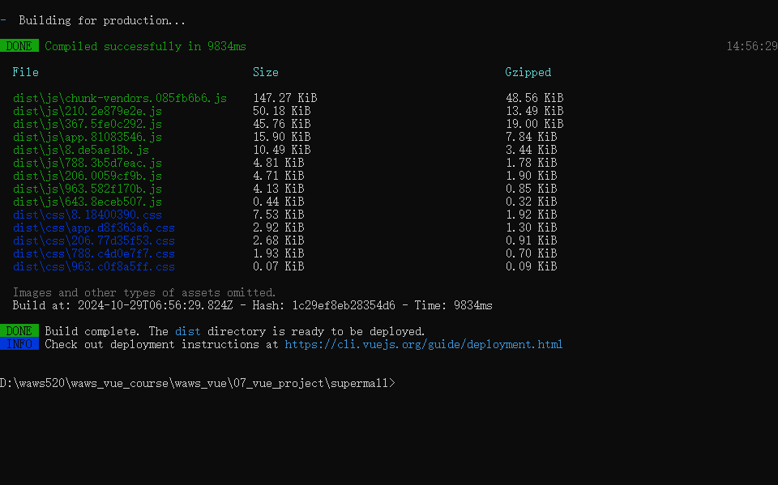
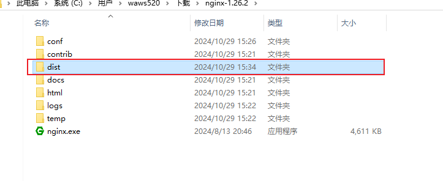
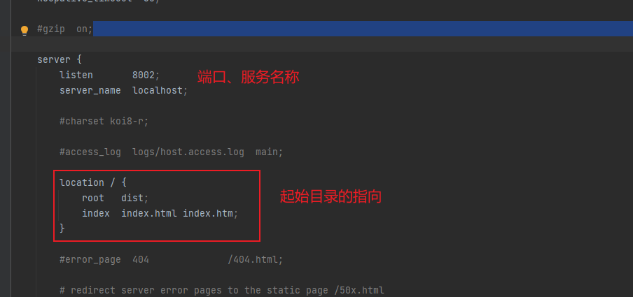
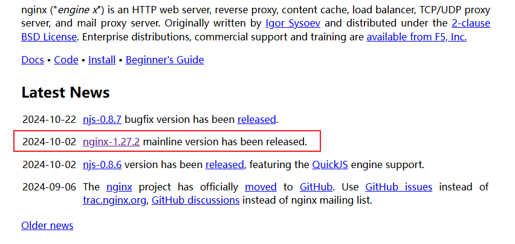
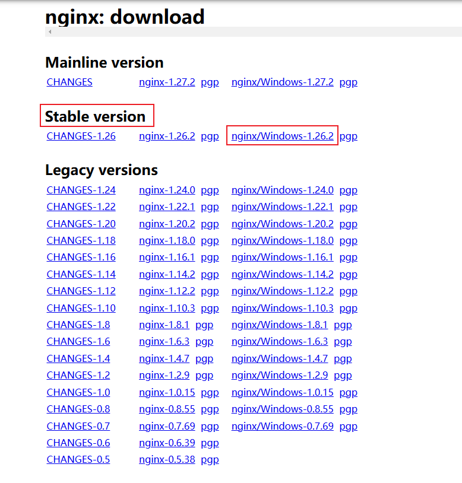
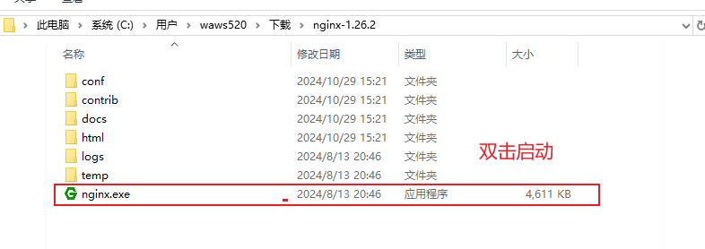
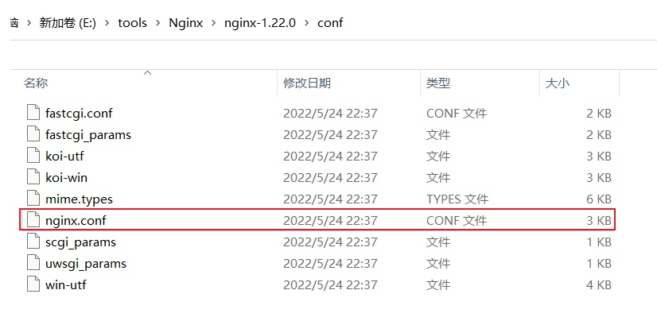
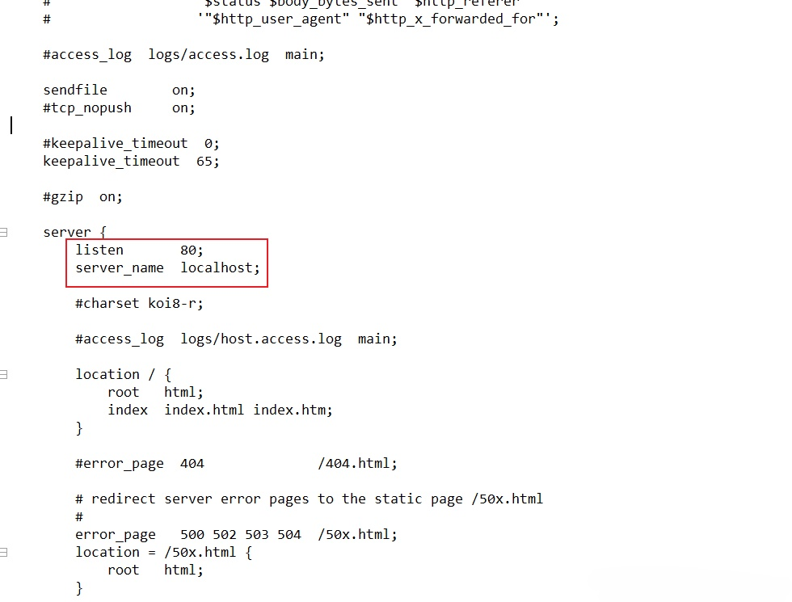
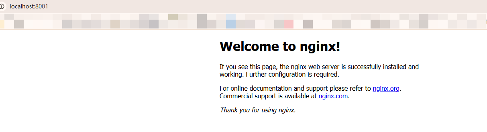

# 项目_11

## 部署

1. 前端打包

```js
npm run build
```



2. 使用nginx进行部署
   - 将上面打包好的dist文件夹，放入到nginx中



### 第一种方式

1. 我们可以将dist中的文件对html文件进行覆盖


2. 重启下nginx(双击nginx.exe)，直接在浏览器中输入localhost:8001，项目即可跑起来


### 第二种方式

1. 我们修改nginx.conf中起始文件的配置



2. 重启下nginx(双击nginx.exe)，直接在浏览器中输入localhost:8002，项目即可跑起来


## Nginx

[安装Nginx以及简单使用 —— windows系统](https://blog.csdn.net/xuezhe5212/article/details/140212065)

nginx的官网：https://nginx.org/

#### 安装



- Mainline version：Mainline 是Nginx目前主力在做的版本，可以说是开发版本
- Stable version：最新的稳定版，生产环境中建议使用的版本
- Legacy versions：遗留的老版本的稳定版



解压后，双击启动



查看是不是启动成功了(一闪而过) 默认启动的是80端口

如果被占用，更改下配置文件中的端口即可(我们修改成8001)
Nginx的配置文件是在conf目录下的nginx.conf文件





修改成8001后，在浏览器中输入localhost，能看到下面网页即可



