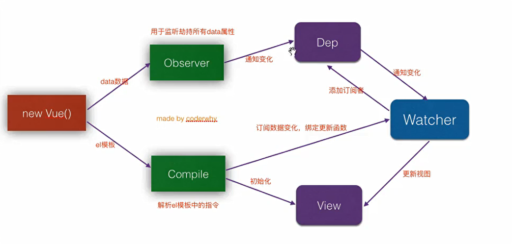
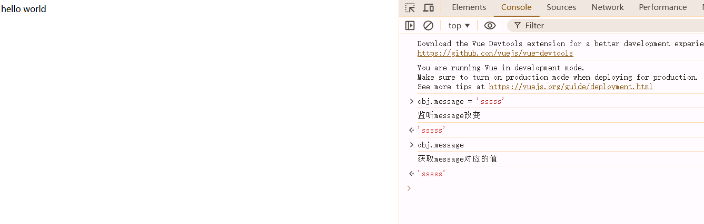
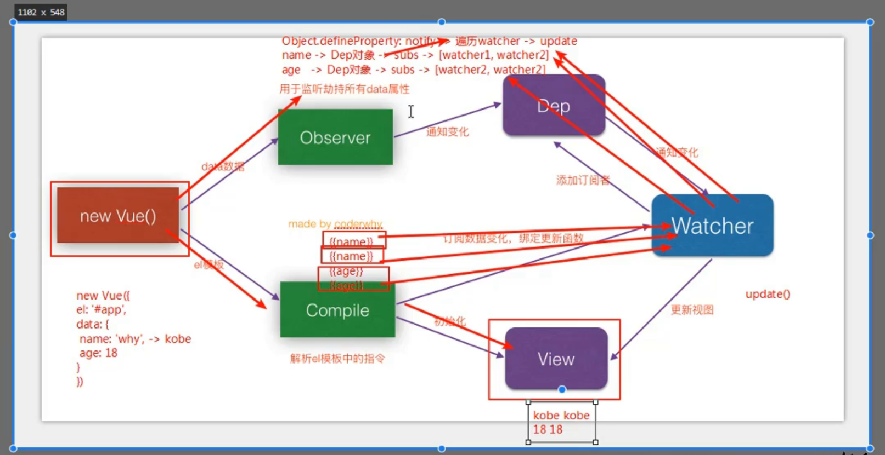

# 项目_12

## 响应式原理



```js
<!DOCTYPE html>
<html lang="en">
<head>
    <meta charset="UTF-8">
    <title>Title</title>
</head>
<body>

<div id="app">
    {{message}}    // 张三
    {{message}}    // 李四
    {{message}}    // 王五
</div>

<script src="../vue.js"></script>

<script>
    const obj = {
        message:"hello world",
        name:'waws520'
    }
    Object.keys(obj).forEach(key => {
        let value = obj[key]

        Object.defineProperty(obj,key,{
            set(newValue){
                console.log('监听' + key + '改变')
                // 根据解析html代码，获取到哪些人有这个属性
                // 张三/李四/王五
                value = newValue
                // dep.notify()
            },
            get(){

                // console.log('获取' + key + '对应的值')
                // 张三:get-->update
                // 李四:get-->update
                // 王五:get-->update
                const w1 = new Watcher('张三')
				dep.addSub(w1)
                return value
            }
        })
    })

    // 发布者
    class Dep{
        constructor() {
            this.subs = []
        }
        addSub(watcher){
            this.subs.push(watcher)
        }
        notify(){
            this.subs.forEach(item =>{
                item.update()
            })
        }
    }

    // 订阅者
    class Watcher {
        constructor(name) {
            this.name = name
        }

        update(){
            console.log(this.name + '发生了update')
        }
    }

    const dep = new Dep()
    const w1 = new Watcher('张三')
    dep.addSub(w1)

    const w2 = new Watcher('李四')
    dep.addSub(w2)

    const w3 = new Watcher('王五')
    dep.addSub(w3)

    dep.notify()
</script>

<script>
    const app = new Vue({
        el:"#app",
        data:{
            message:"hello world",
            name:'waws'
        }
    })
</script>
</body>
</html>
```

1. app.message修改数据，Vue内部是如何监听message数据的改变
   - Object.defineProperty  监听对象属性的改变
   - 根据解析html代码，获取到那些人在使用属性
2. 当数据发生改变，Vue是如何知道要通知哪些人，界面需要改变刷新
   - 发布订阅者模式

> 原理：是我们在`defineProperty`中对于属性的更改和获取中添加了发布者和订阅者(观察者)的部分
>
> - 解析html的时候将各个用到的部分创建观察者，然后将其放入到订阅者的队列中
> - 然后当属性发生改变的时候，会去调用发布者的notify方法通知所有的观察者进行update方法

监听到了值的改变





代码：https://github.com/fyuanfen/note/blob/69681beee8f8ca1bce5c29bb441a5febfab01298/article/Vue/vue%E5%8F%8C%E5%90%91%E7%BB%91%E5%AE%9A%E5%8E%9F%E7%90%86%E5%8F%8A%E5%AE%9E%E7%8E%B0.md

```js
<!DOCTYPE html>
<html lang="en">
<head>
    <meta charset="UTF-8">
    <meta name="viewport" content="width=device-width, initial-scale=1.0">
    <title>双向数据绑定原理ES6</title>
</head>
<body>
<div id="app">
    <input type="text" v-model="message">{{message}}
</div>
<script>
    class Vue{
        constructor(options){
            // 1.保存数据
            this.$options=options
            this.$data=options.data
            this.$el=options.el
            // console.log(this.$data)
            // 2.将data添加到响应式系统中
            new Observer(this.$data)
            // 3.代理this.$data的数据
            // 作用----我们的代码可以与代理交互，而不是直接访问目标对象
            // 不想加可以直接去掉，把this.vm后加一个.$data
            Object.keys(this.$data).forEach(key=>{
                // console.log(key)
                this._proxy(key)
            })
            // 4.处理el
            new Compiler(this.$el,this)
        }
        _proxy(key){
            // console.log(this.$data[key])  //quan/{name:'铨',age:'21'}
            // console.log(key)//message/info
            // console.log(this)  //Vue
            Object.defineProperty(this,key,{//message/info数据的改变都是通过这里
                configurable:true,
                enumerable:true,
                set(newValue){
                    this.$data[key]=newValue
                },
                get(){
                    return this.$data[key]
                }
            })
        }
    }
    class Observer{
        constructor(data){
            this.data=data
            // console.log(this.vm)
            // console.log(this.data)
            Object.keys(data).forEach(key=>{//Object.key得到的是一个数组
                // console.log(key)
                this.defineReactive(this.data,key,data[key])
            })
        }
        defineReactive(data,key,val){
            // console.log(data)//Vue里面的data数据
            // console.log(key)
            // console.log(val)
            const dep=new Dep()
            Object.defineProperty(data,key,{
                enumerable:true,
                configurable:true,
                get(){
                    if(Dep.target){
                        dep.addSub(Dep.target)
                    }
                    return val
                },
                set(newValue){
                    if(newValue===val){
                        return
                    }
                    val=newValue
                    dep.notify()
                }
            })
        }
    }
    class Dep{
        constructor(){
            this.subs=[]
        }
        addSub(sub){
            this.subs.push(sub)
        }
        notify(){
            this.subs.forEach(sub=>{
                sub.update()
            })
        }
    }
    class Watcher{
        constructor(node,name,vm){
            this.node=node
            this.name=name
            this.vm=vm
            Dep.target=this
            this.update()
            Dep.target=null
        }
        update(){
            this.node.nodeValue=this.vm.$data[this.name]
            // this.node.nodeValue=this.vm[this.name]
        }
    }
    const reg=/\{\{(.*)\}\}/
    class Compiler{
        constructor(el,vm){
            this.el=document.querySelector(el)
            this.vm=vm

            this.frag=this._createFragment()
            // 加回节点
            this.el.appendChild(this.frag)
        }
        _createFragment(){
            const frag=document.createDocumentFragment()
            let child
            while (child=this.el.firstChild) {
                this._compile(child)
                frag.appendChild(child)
            }
            return frag
        }
        _compile(node){
            if(node.nodeType===1){
                const attrs=node.attributes
                // console.log(attrs)
                if(attrs.hasOwnProperty('v-model')){
                    var name=attrs['v-model'].nodeValue
                    // console.log(name)
                }
                node.addEventListener('input',e=>{
                    this.vm.$data[name]=e.target.value
                    // this.vm[name]=e.target.value
                })
                node.value=this.vm.$data[name]
                // node.value=this.vm[name]
            }
            if(node.nodeType===3){
                if(reg.test(node.nodeValue)){
                    const name=RegExp.$1.trim()
                    new Watcher(node,name,this.vm)
                }
            }
        }
    }
</script>
<script>
    const app=new Vue({
        el:'#app',
        data:{
            message:'waws520',
            info:{
                name:'waws',
                age:'18'
            }
        }
    })
</script>
</body>
</html>
```

